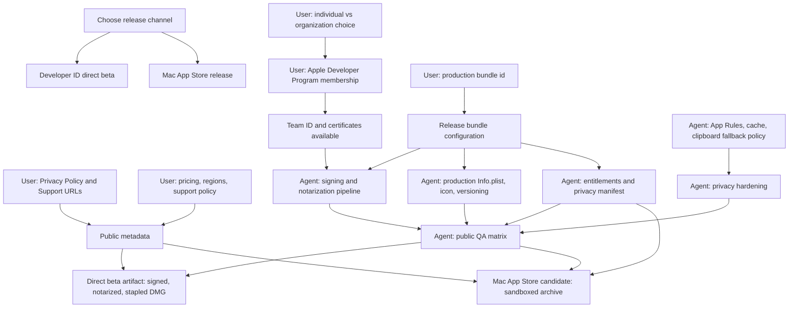

# Overlaygent Public Release Checklist

Last updated: 2026-06-30 KST

Current release judgment: not ready for public web distribution yet.

This file tracks what must happen before Overlaygent can be shared publicly. Keep
it lightweight and update the checkboxes whenever a decision is made, a blocker is
removed, or a release gate is verified.

## Status Legend

- `[ ]` Not started
- `[-]` In progress
- `[x]` Done and verified
- `[?]` Blocked or waiting for a decision/input
- `[!]` Risk found, needs follow-up

## Release Dependency Graph

## Track 0: Release Strategy

- [x] Decide first public channel.
  - Decision: distribute a notarized DMG from a website.
  - Mac App Store is out of scope for the first public release.
- [ ] Define what "public beta ready" means.
  - Suggested minimum: signed/notarized DMG, privacy policy, app rules, cache
    policy, Slack/ChannelTalk/Discord/Notion/VS Code smoke pass.
- [ ] Define what "Mac App Store ready" means.
  - Suggested minimum: sandbox-compatible archive, App Store metadata, privacy
    answers, screenshots, reviewer notes, no obvious review blockers.

## Track 1: User-Owned Inputs

These are things the agent cannot complete without the user's account, legal, or
business decisions.

- [x] Enroll in the Apple Developer Program.
  - Needed for: Developer ID certificate, App Store Connect, notarization.
  - Do not paste Apple credentials into this repo or checklist.
- [x] Choose seller identity.
  - Decision: individual account.
  - Options: individual account or organization account.
  - Organization release may require D-U-N-S and legal authority checks.
- [x] Choose final production bundle id.
  - Decision: `com.suhshin.overlaygent`.
  - Current dev bundle id is `com.polar.OverlaygentDev`.
- [x] Confirm final public app name.
  - Decision: `Overlaygent`.
- [x] Prepare Privacy Policy URL.
  - Must cover: current input text, optional visible conversation context, LLM
    provider sharing, local API key storage, local cache/retention/deletion,
    clipboard fallback, support contact.
- [x] Prepare Support URL.
  - Can be a simple public page, GitHub page, or documentation page.
  - Privacy Policy URL:
    `https://github.com/rkskekzzz/overlaygent/blob/main/docs/PRIVACY.md`.
  - Support URL:
    `https://github.com/rkskekzzz/overlaygent/blob/main/docs/SUPPORT.md`.
- [ ] Decide pricing and distribution regions.
  - Required for App Store. Useful for direct beta positioning too.
- [ ] Decide provider policy.
  - Options: bring-your-own-key only, bundled provider later, or both.
- [ ] Decide whether direct beta is public, private link, or invite-only.
- [x] Provide local signing/notarization access.
  - Examples: Xcode signed into the right team, Developer ID certificate in
    Keychain, notarytool profile, or App Store Connect API key configured
    locally.
  - Developer ID Application certificate is installed locally:
    `Developer ID Application: suhyoung shin (54PCB24H6S)`.
  - Notarization profile is configured locally and verified with `notarytool`.

## Track 2: Agent-Owned Release Packaging

These tasks can be implemented once Track 1 has the required inputs.

- [x] Add production bundle metadata.
  - Create durable release `Info.plist` or generation script.
  - Include production bundle id, version/build, minimum macOS, display name.
  - Release script defaults to `com.suhshin.overlaygent` and app name
    `Overlaygent`.
- [ ] Add app icon assets.
  - Need `.icns` for direct distribution and App Store screenshots/branding.
- [x] Add release build script.
  - Build release binary, assemble `.app`, inject version, verify contents.
- [x] Add Developer ID signing support.
  - Use hardened runtime.
  - Avoid local-dev identity fallback for release builds.
- [x] Add notarization script.
  - Submit with `notarytool`, wait for result, staple ticket, verify.
- [x] Add DMG packaging.
  - Produce a repeatable `Overlaygent-x.y.z.dmg`.
- [x] Add release verification script.
  - Expected gates: `codesign --verify`, `spctl --assess`, `stapler validate`,
    launch smoke, checksum generation.
- [x] Separate dev and release artifacts.
  - Keep `scripts/build-dev-app.sh` useful for local iteration.
  - Add explicit release scripts so dev bundle settings never leak to public
    artifacts.

## Track 3: Agent-Owned Privacy And Safety Hardening

These are blockers before a trust-sensitive public beta.

- [x] Align clipboard fallback policy with UI copy.
  - Decision: disabled by default; a future settings surface may provide explicit opt-in.
  - Live runs now use `allowClipboardFallback: false` and privacy copy matches.
- [x] Add response cache policy.
  - Decision: disabled by default for public builds because responses may contain user text.
  - Live correction runs now use the no-op cache and privacy copy documents non-retention.
- [ ] Add local data deletion controls.
  - Clear provider settings, agent profiles, memory, and response cache where
    appropriate.
- [ ] Add App Rules UI.
  - The Dashboard has an App Rules section, but it is currently a placeholder.
  - Needed: enable/disable per app, visible current app, persisted rules.
- [x] Add explicit third-party AI disclosure in product copy.
  - Privacy copy states that the configured provider processes request data under its own terms.
  - The user-selected provider receives the current input and selected context.
- [ ] Review logs for sensitive text leaks.
  - Verify raw input, API keys, provider responses, and context are not logged.
- [ ] Review Keychain behavior for production bundle id migration.
  - The keychain service prefix has already moved to `Overlaygent.*`, but release
    signing/bundle identity should be checked.
- [ ] Add PrivacyInfo.xcprivacy if App Store path is pursued.
  - Needed especially if required-reason APIs or collected data declarations
    apply.

## Track 4: Agent-Owned Product Completion

- [ ] Finish App Rules product surface.
- [ ] Add first-run checklist for required Accessibility permission.
- [ ] Add better "no input / unsupported input" user feedback.
- [ ] Add user-facing diagnostics export that redacts sensitive text.
- [ ] Add update/about window with app version and support link.
- [ ] Confirm menu bar app behavior on restart, quit, and relaunch.
- [ ] Decide whether debug overlay probe should remain in public builds.
  - If kept, hide it behind a developer/debug flag.

## Track 5: Manual QA Matrix

The agent can create and maintain the matrix, but real app behavior must be
validated on a macOS desktop with the target apps installed.

- [ ] Slack
  - [ ] Read focused draft
  - [ ] Show overlay near input
  - [ ] Run real provider call
  - [ ] Apply suggestion
  - [ ] Undo behavior acceptable
  - [ ] Secure/private fields blocked
  - [ ] Empty input does not show noisy overlay
- [ ] ChannelTalk
  - [ ] Read focused draft
  - [ ] Visible context opt-in works
  - [ ] Apply suggestion
  - [ ] Failure state is understandable
- [ ] Discord
  - [ ] Read focused draft
  - [ ] Apply suggestion
  - [ ] Electron accessibility enablement works
- [ ] Notion Desktop
  - [ ] Read focused text where supported
  - [ ] Rich text limitations are clear
  - [ ] Apply path does not corrupt content
- [ ] VS Code
  - [ ] Comment/input fields supported where feasible
  - [ ] Monaco/rich editor limitations are clear
  - [ ] Clipboard fallback behavior is safe if enabled
- [ ] macOS permission states
  - [ ] Accessibility not granted
  - [ ] Accessibility granted
  - [ ] Permission revoked while app is running
- [ ] Display/window states
  - [ ] Single display
  - [ ] Multi-display
  - [ ] Fullscreen app
  - [ ] Different Spaces

## Track 6: Mac App Store Track

Deferred. Only start this if the release strategy changes.

- [ ] Create App Store Connect app record.
- [ ] Configure bundle id and capabilities.
- [ ] Add sandbox entitlements.
- [ ] Verify Accessibility-dependent behavior under sandbox constraints.
- [ ] Add App Store screenshots.
- [ ] Write App Store description, subtitle, keywords, and reviewer notes.
- [ ] Fill App Privacy answers.
- [ ] Add privacy policy URL and support URL.
- [ ] Create Xcode/App Store archive workflow or equivalent supported export.
- [ ] Submit TestFlight build.
- [ ] Run TestFlight install and smoke test.
- [ ] Submit for App Review.

## Current Verified State

Verified on 2026-06-29 KST:

- [x] `git diff --check`
- [x] `swift test`
  - Result observed: 257 tests, 0 failures.
- [x] `bash scripts/mvp-smoke.sh all`
- [x] `swift build -c release`
- [x] `bash scripts/build-dev-app.sh`
- [x] `codesign --verify --deep --strict --verbose=4 .build/dev-app/Overlaygent.app`
- [!] `spctl --assess --type execute --verbose=4 .build/dev-app/Overlaygent.app`
  - Result observed: rejected.
  - Expected for current dev/local signing; not acceptable for public direct
    distribution.
- [x] Git remote sync check
  - `git rev-list --left-right --count origin/main...HEAD` returned `0 0`.
- [!] Working tree has uncommitted code/script changes unrelated to this
  checklist.

Verified on 2026-06-30 KST:

- [x] `security find-identity -v -p codesigning`
  - Result observed: `Developer ID Application: suhyoung shin (54PCB24H6S)`.
- [x] `bash -n scripts/build-release-app.sh`
- [x] `bash -n scripts/package-release-dmg.sh`
- [x] `bash -n scripts/notarize-release-dmg.sh`
- [x] `bash -n scripts/verify-release-artifacts.sh`
- [x] `git diff --check`
- [x] `scripts/build-release-app.sh`
  - Result observed: `.build/release-app/Overlaygent.app` built with bundle id
    `com.suhshin.overlaygent`, hardened runtime, Developer ID timestamp, and
    valid code signature.
- [x] `scripts/package-release-dmg.sh`
  - Result observed: `.build/dist/Overlaygent-0.1.0+1.dmg` created, signed, and
    SHA-256 checksum generated.
- [x] `OVERLAYGENT_NOTARY_PROFILE=my-notary scripts/notarize-release-dmg.sh`
  - Submission ID: `b81a83c5-06bd-4138-83f1-8ffbe4cdf320`.
  - Result observed: Apple notarization status `Accepted`, DMG stapled, and
    Gatekeeper accepted with `source=Notarized Developer ID`.
- [x] `scripts/verify-release-artifacts.sh`
  - Result observed: `.build/release-app/Overlaygent.app` and
    `.build/dist/Overlaygent-0.1.0+1.dmg` both accepted with
    `source=Notarized Developer ID`.
- [x] `.build/dist/Overlaygent-0.1.0+1.dmg.sha256`
  - SHA-256:
    `7822b19bfb7d2b4cbd3ffd4ab57c37208fdda76895862ad7f8551851a1785fa8`.

## Immediate Next Steps

- [x] User: confirm release channel for first public build.
  - Decision: website distribution as a notarized DMG.
- [x] User: enroll or confirm Apple Developer Program access.
- [x] User: choose production bundle id.
  - Decision: `com.suhshin.overlaygent`.
- [x] User: provide Privacy Policy URL and Support URL, or ask agent to draft
  local `PRIVACY.md` and `SUPPORT.md` first.
- [x] User: create local notarytool profile or provide App Store Connect API key
  configuration locally.
- [x] Agent: implement release packaging and notarization pipeline after signing
  access exists.
- [ ] Agent: fix privacy hardening blockers before the first public artifact.
