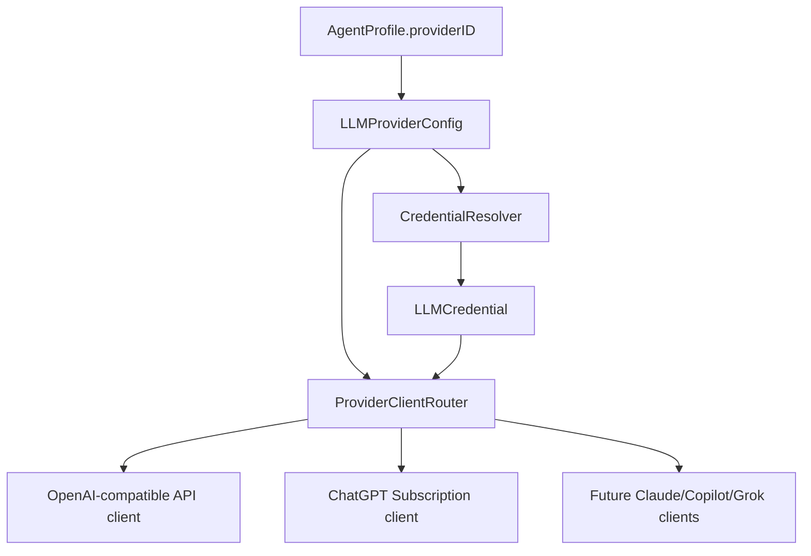

# Subscription Provider Auth Spec

조사일: 2026-07-01

## 목표

Overlaygent의 Provider 탭을 API key 중심에서 Subscription provider 중심으로 확장한다. Aside처럼 `Subscription`과 `API`를 같은 provider 관리 화면 안에서 구분하고, 사용자는 ChatGPT Subscription 같은 계정 로그인 기반 provider를 먼저 연결할 수 있어야 한다. 기존 OpenAI-compatible API key 방식은 계속 지원하되, 직접 API 과금용 고급/옵션 경로처럼 보이게 한다.

이 문서는 조사 자료와 구현 스펙을 함께 남긴다. 2026-07-01 1차 구현은 `ChatGPT Subscription` provider, provider/auth abstraction, Provider 탭 grouping, 그리고 명시적인 `Import Codex Login` MVP까지 포함한다.

## 참고자료

| 출처 | 신뢰도 | 확인한 내용 | Overlaygent에 주는 의미 |
| --- | --- | --- | --- |
| [OpenAI Codex Auth](https://developers.openai.com/codex/auth#openai-authentication) | 공식 | Codex는 OpenAI 모델 사용 시 `ChatGPT sign-in for subscription access`와 `API key for usage-based access`를 모두 지원한다. ChatGPT 로그인은 브라우저 로그인 후 access token을 CLI/IDE로 돌려준다. 일반 OpenAI API 호출은 Platform API key를 계속 사용하라고 명시한다. | `ChatGPT Subscription`은 가능성이 확인된 경로지만, `api.openai.com` 일반 API key 대체물이 아니다. Codex/ChatGPT auth 전용 provider로 모델링해야 한다. |
| [OpenAI alternative model providers](https://developers.openai.com/codex/auth#alternative-model-providers) | 공식 | Codex custom provider는 `requires_openai_auth = true`, env key, no auth 중 하나를 선택한다. `requires_openai_auth`는 ChatGPT 로그인 또는 API key 기반 OpenAI auth를 재사용한다. | provider config에 auth mode를 first-class로 둬야 한다. `apiKey` 필드 하나로 모든 provider를 표현하면 막힌다. |
| [OpenAI custom model providers](https://developers.openai.com/codex/config-advanced#custom-model-providers) | 공식 | provider는 base URL, wire API, auth, headers를 묶는 개념이다. command-backed auth도 지원한다. | Overlaygent도 endpoint/wire API/auth를 분리하는 쪽이 맞다. 특히 subscription token은 command/helper/native OAuth 어디서 오든 동일한 credential resolver 뒤에 숨겨야 한다. |
| [OpenClaw OAuth docs](https://github.com/openclaw/openclaw/blob/main/docs/concepts/oauth.md) | 비공식 구현 참고 | OpenClaw는 OpenAI Codex ChatGPT OAuth를 subscription auth로 다룬다. PKCE, loopback callback, token exchange, refresh token 저장, multi-profile routing을 설명한다. | native OAuth 구현의 구조 참고자료다. 다만 OpenAI 공식 third-party integration 문서는 아니므로 MVP에는 실험 플래그/리스크 표기가 필요하다. |
| [OpenAI Community thread](https://community.openai.com/t/login-with-chatgpt-instead-of-bring-your-own-token/1380525) | 커뮤니티/제품 신호 | 사용자가 ChatGPT 로그인 기반 BYOT 대체 문서를 물었고, 답변에서는 공식 문서 부족과 OpenClaw/opencode 사례를 언급한다. | “된다”는 시장 신호는 있지만, 공식 API product contract로 보기는 어렵다. 지원 문구를 조심해야 한다. |
| [GeekNews openai-oauth 글](https://news.hada.io/topic?id=28569) / [openai-oauth](https://github.com/EvanZhouDev/openai-oauth) | 비공식 구현 참고 | `~/.codex/auth.json` 토큰을 이용해 localhost OpenAI-compatible proxy를 띄우는 사례다. 글과 README 모두 비공식, 개인 로컬 실험, password-equivalent credential 취급을 경고한다. | 빠른 spike 후보지만, 제품 기능으로 그대로 의존하기에는 보안/약관/배포 리스크가 크다. |
| [Claude Code authentication](https://docs.anthropic.com/en/docs/claude-code/authentication) | 공식 | Claude Code는 Claude.ai subscription login, Console login, cloud provider, OAuth token, API key/helper 등 다양한 인증을 지원한다. | `Claude Subscription`은 직접 Anthropic API key provider가 아니라 Claude Code/Claude OAuth helper 계열 provider로 별도 adapter가 필요하다. |
| [Claude API authentication](https://platform.claude.com/docs/en/manage-claude/authentication) | 공식 | Claude API는 API key 또는 Workload Identity Federation을 공식 인증 경로로 제공한다. | 일반 Anthropic API provider는 여전히 API key/WIF provider다. subscription provider와 섞으면 안 된다. |

## 변경 전 구조 요약

변경 전 구현은 API key를 provider의 필수 credential로 가정했다.

- `Sources/Overlaygent/Domain/SharedDomainModels.swift`
  - `LLMProviderConfig`가 `baseURL`, `defaultModel`, `temperature`, `maxTokens`, `timeoutSeconds`, `keychainServiceName`을 직접 가진다.
- `Sources/Overlaygent/Storage/LLMProviderStore.swift`
  - 기본 provider는 `https://api.openai.com/v1`의 OpenAI-compatible API provider다.
- `Sources/Overlaygent/Storage/LLMProviderAPIKeyStoring.swift`
  - 저장소 프로토콜이 API key 전용이다.
- `Sources/Overlaygent/Storage/KeychainStore.swift`
  - Keychain account도 `api-key` 고정이다.
- `Sources/Overlaygent/Correction/CorrectionEngine.swift`
  - provider 호출 전에 API key를 읽고, 비어 있으면 `.missingAPIKey`로 실패한다.
- `Sources/Overlaygent/Correction/LLMProvider.swift`
  - `complete(..., apiKey: String?)` 시그니처라 credential 종류가 API key뿐이다.
- `Sources/Overlaygent/Correction/OpenAICompatibleProvider.swift`
  - `Authorization: Bearer <apiKey>`와 `/chat/completions`를 고정한다.
- `Sources/Overlaygent/Correction/OpenAICompatibleModelLister.swift`
  - 모델 목록 조회도 API key를 필수로 요구한다.
- `Sources/Overlaygent/Dashboard/ProviderSettingsView.swift`
  - Provider 목록, 상태 pill, 상세 폼, 모델 refresh가 모두 API key 저장 여부에 맞춰져 있다.
- `Sources/Overlaygent/App/AppEnvironment.swift`
  - 앱 composition root에서 단일 `OpenAICompatibleProvider`와 `KeychainStore`를 직접 주입한다.

핵심 병목은 `provider = endpoint config + API key`라는 모델이다. Subscription provider를 넣으려면 `provider`, `auth`, `wire client`를 분리해야 한다.

## 목표 아키텍처

Provider는 “어떤 모델을 어떤 방식으로 호출할지”의 사용자 설정이다. Auth는 “그 호출에 필요한 credential을 어떻게 얻고 저장할지”다. Transport는 “어떤 endpoint/wire API로 요청을 보낼지”다.

```swift
enum LLMProviderCategory: String, Codable, Equatable {
    case subscription
    case api
    case local
}

enum LLMProviderKind: String, Codable, Equatable {
    case chatGPTSubscription
    case claudeSubscription
    case openAICompatibleAPI
    case anthropicAPI
    case localOpenAICompatible
}

enum LLMProviderWireAPI: String, Codable, Equatable {
    case openAIChatCompletions
    case openAIResponses
    case codexBackendResponses
    case anthropicMessages
}

enum LLMProviderAuthMode: String, Codable, Equatable {
    case subscriptionOAuth
    case apiKey
    case bearerTokenCommand
    case none
}

struct LLMProviderAuthConfig: Codable, Equatable {
    var mode: LLMProviderAuthMode
    var keychainServiceName: String?
    var subscriptionService: SubscriptionService?
    var profileID: String?
    var credentialCommand: CredentialCommandConfig?
}

struct LLMProviderEndpointConfig: Codable, Equatable {
    var baseURL: URL?
    var wireAPI: LLMProviderWireAPI
    var extraHeaders: [String: String]
}
```

실제 `LLMProviderConfig`는 기존 필드를 전부 한 번에 없애기보다 아래처럼 확장하고, decode migration으로 구버전 JSON을 API provider로 읽는 방식이 안전하다.

```swift
struct LLMProviderConfig: Codable, Identifiable, Equatable {
    var id: UUID
    var name: String
    var category: LLMProviderCategory
    var kind: LLMProviderKind
    var endpoint: LLMProviderEndpointConfig
    var auth: LLMProviderAuthConfig
    var defaultModel: String
    var reasoningEffort: ReasoningEffort?
    var temperature: Double
    var maxTokens: Int
    var timeoutSeconds: Double
}
```

구버전 migration 규칙:

- `category`가 없으면 `.api`
- `kind`가 없으면 `.openAICompatibleAPI`
- `endpoint.baseURL`은 기존 `baseURL`
- `endpoint.wireAPI`는 `.openAIChatCompletions`
- `auth.mode`는 `.apiKey`
- `auth.keychainServiceName`은 기존 `keychainServiceName`

## Credential Resolver

`CorrectionEngine`은 더 이상 API key를 직접 읽으면 안 된다. 대신 provider별 credential을 resolver가 결정한다.

```swift
enum LLMCredential: Equatable {
    case apiKey(String)
    case bearerToken(String)
    case none
}

protocol LLMProviderCredentialResolving {
    func credential(for provider: LLMProviderConfig) async throws -> LLMCredential
}
```

구현 후보:

- `APIKeyCredentialResolver`
  - 기존 `LLMProviderAPIKeyStoring`를 감싸거나, 새 `LLMProviderSecretStoring`로 대체한다.
- `SubscriptionCredentialResolver`
  - native OAuth token store 또는 command-backed helper에서 access token을 얻는다.
  - 만료 시 refresh 후 Keychain에 갱신한다.
- `CompositeProviderCredentialResolver`
  - `provider.auth.mode`에 따라 위 resolver를 라우팅한다.

오류도 API key 전용에서 credential 전용으로 바꾼다.

```swift
enum AgentCorrectionFailure {
    case missingProvider(providerID: UUID)
    case missingCredential(providerID: UUID, mode: LLMProviderAuthMode)
    case credentialLoadFailed(providerID: UUID, reason: String)
    case loginRequired(providerID: UUID)
    case providerFailed(providerID: UUID, reason: String)
    case parseFailed(providerID: UUID)
}
```

## Provider Client Router

`OpenAICompatibleProvider` 하나에 모든 provider를 넣지 않는다. provider kind/wire API별 client를 라우팅한다.

```swift
protocol LLMProviderClient {
    func complete(
        bundle: AgentMessageBundle,
        provider: LLMProviderConfig,
        credential: LLMCredential
    ) async throws -> String
}

struct LLMProviderClientRouter: LLMProviderClient {
    var openAICompatible: OpenAICompatibleProvider
    var chatGPTSubscription: ChatGPTSubscriptionProvider
    var anthropicAPI: AnthropicMessagesProvider?

    func complete(...) async throws -> String {
        switch provider.kind {
        case .openAICompatibleAPI, .localOpenAICompatible:
            return try await openAICompatible.complete(...)
        case .chatGPTSubscription:
            return try await chatGPTSubscription.complete(...)
        case .anthropicAPI:
            return try await anthropicAPI.complete(...)
        case .claudeSubscription:
            throw LLMProviderError.unsupportedProvider
        }
    }
}
```

`OpenAICompatibleProvider`는 credential을 받아 `apiKey` 또는 `bearerToken`을 `Authorization` header로 변환한다. `none`은 local no-auth provider에서만 허용한다.

`ChatGPTSubscriptionProvider`는 두 구현 중 하나로 시작할 수 있다.

1. Native OAuth 구현
   - `ASWebAuthenticationSession` 또는 loopback callback으로 ChatGPT/Codex OAuth를 수행한다.
   - PKCE verifier/challenge, state, token exchange, refresh를 구현한다.
   - token은 Keychain에 저장한다.
   - 장점: 앱 UX가 Aside처럼 자연스럽다.
   - 단점: third-party OAuth client contract와 Codex backend wire contract가 공식 API 문서로 충분히 안정화되어 있지 않다.
2. Local helper/proxy 구현
   - 사용자가 명시적으로 `codex login` 또는 helper login을 완료한 뒤, Overlaygent가 command-backed bearer token 또는 localhost OpenAI-compatible proxy를 사용한다.
   - 장점: 빠른 spike, OpenClaw/openai-oauth와 유사하다.
   - 단점: 제품 배포용 UX와 보안 설계가 약하고, Node/npx 의존성을 번들링하면 macOS app 배포가 지저분해진다.

권장 순서:

- 1차 구현은 auth abstraction과 UI grouping을 먼저 넣는다.
- ChatGPT Subscription은 `Experimental` 플래그 뒤에서 native OAuth spike로 검증한다.
- local proxy 방식은 spike/검증 도구로만 남기고, 일반 사용자용 기본 경로로 두지 않는다.

## UI 스펙

Provider 탭은 Aside 스크린샷처럼 provider 종류를 그룹화한다.

### Overview

- 상단 설명 문구를 “model endpoints and API keys”에서 “model accounts, subscriptions, and optional API endpoints”로 바꾼다.
- Provider 목록을 `Subscription`, `API`, `Local` 섹션으로 나눈다.
- 각 row는 provider category에 맞는 아이콘/상태를 표시한다.
  - ChatGPT Subscription: account connected / login required / expired
  - API provider: key stored / no key
  - Local provider: reachable / not checked
- `Add Provider` 버튼은 단순 추가가 아니라 menu를 연다.
  - Subscription
    - ChatGPT Subscription
    - Claude Subscription, disabled 또는 Coming soon
    - GitHub Copilot, disabled 또는 Coming soon
    - Grok Subscription, disabled 또는 Coming soon
  - API
    - OpenAI Compatible API
    - Anthropic API, future
  - Local
    - OpenAI-compatible Local

### Detail

공통 필드:

- Provider name
- Default model
- Reasoning effort
- Temperature
- Max tokens
- Timeout seconds

Subscription provider 전용:

- Account status
- Connect / Disconnect / Reauthorize
- Profile 선택 또는 표시
- Model refresh
- Advanced: endpoint/wire API/debug info
- API key field는 표시하지 않는다.

API provider 전용:

- Base URL
- API key SecureField
- Save Key / Delete Key
- Model refresh
- Advanced: headers, wire API

Copy 방향:

- API key provider copy는 “direct API billing / optional advanced” 느낌으로 둔다.
- Subscription provider copy는 “uses your signed-in account/subscription; availability follows that account”로 둔다.
- “무료 API”처럼 보이는 문구는 피한다. 공식적으로는 subscription entitlement와 plan limits를 따르는 경로다.

## 파일별 수정 계획

### Domain

- `Sources/Overlaygent/Domain/SharedDomainModels.swift`
  - `LLMProviderCategory`, `LLMProviderKind`, `LLMProviderWireAPI`, `LLMProviderAuthMode`, `LLMProviderAuthConfig`, `LLMProviderEndpointConfig`, `SubscriptionService`, `CredentialCommandConfig` 추가
  - `LLMProviderConfig` custom `Codable` migration 추가
  - `AgentProfile.providerID`는 유지한다. agent routing은 provider ID만 알면 된다.

### Storage

- `Sources/Overlaygent/Storage/LLMProviderStore.swift`
  - `defaultOpenAICompatible`를 API provider factory로 유지
  - `defaultChatGPTSubscription` factory 추가
  - fresh install seed 정책 결정
    - 권장: ChatGPT Subscription + OpenAI Compatible API를 둘 다 생성하되, ChatGPT를 첫 번째로 표시
    - 보수안: 기존 API provider만 유지하고 Add menu에서 subscription을 추가
- `Sources/Overlaygent/Storage/LLMProviderAPIKeyStoring.swift`
  - 새 protocol로 확장 또는 rename
  - 후보명: `LLMProviderSecretStoring`
  - API key뿐 아니라 OAuth token bundle도 저장할 수 있어야 한다.
- `Sources/Overlaygent/Storage/KeychainStore.swift`
  - account를 `api-key` 고정에서 secret kind별로 분리
  - OAuth token bundle은 JSON encode해서 저장
  - in-memory cache도 secret key 기준으로 일반화
- 새 파일 후보
  - `Sources/Overlaygent/Storage/LLMProviderSecretStoring.swift`
  - `Sources/Overlaygent/Storage/SubscriptionTokenStore.swift`

### Auth

새 폴더 후보: `Sources/Overlaygent/Auth/`

- `ProviderCredentialResolver.swift`
  - `LLMProviderCredentialResolving`
  - `LLMCredential`
  - `CompositeProviderCredentialResolver`
- `ChatGPTCodexOAuthClient.swift`
  - PKCE, authorize URL, token exchange, refresh
  - native OAuth spike 시 사용
- `ChatGPTSubscriptionSessionStore.swift`
  - account id, expires, profile id, display email 가능하면 저장
- `CommandBackedCredentialProvider.swift`
  - OpenAI docs의 command-backed auth 패턴과 유사하게 stdout token helper 지원
  - timeout, refresh interval, redaction 처리

### Correction

- `Sources/Overlaygent/Correction/CorrectionEngine.swift`
  - `apiKeyStore` 의존성을 `credentialResolver`로 교체
  - `.missingAPIKey`를 `.missingCredential`/`.loginRequired`로 migration
  - cached response path는 credential lookup 전에 유지한다. 현재 테스트가 이 동작을 보장한다.
- `Sources/Overlaygent/Correction/LLMProvider.swift`
  - `apiKey: String?`를 `credential: LLMCredential`로 교체
  - `LLMProviderError`에 `missingCredential`, `unsupportedProvider`, `unsupportedCredential` 추가
- `Sources/Overlaygent/Correction/OpenAICompatibleProvider.swift`
  - `provider.endpoint.baseURL`, `provider.endpoint.wireAPI` 사용
  - API key 또는 bearer token credential을 header로 변환
  - no-auth local provider 허용 여부를 명시적으로 처리
- `Sources/Overlaygent/Correction/OpenAICompatibleModelLister.swift`
  - `apiKey` 대신 credential resolver 또는 credential을 받도록 변경
  - no-auth local provider, subscription provider 모델 조회를 구분
- 새 파일 후보
  - `Sources/Overlaygent/Correction/LLMProviderClientRouter.swift`
  - `Sources/Overlaygent/Correction/ChatGPTSubscriptionProvider.swift`
  - `Sources/Overlaygent/Correction/ChatGPTSubscriptionModelLister.swift`

### Dashboard

- `Sources/Overlaygent/Dashboard/ProviderSettingsView.swift`
  - 너무 커졌으므로 구현 시 split 권장
  - overview grouping 추가
  - Add Provider menu 추가
  - subscription/API detail form 분리
  - status pill을 credential mode별로 변경
- 새 파일 후보
  - `ProviderSettingsOverview.swift`
  - `ProviderSettingsDetailView.swift`
  - `ProviderSubscriptionForm.swift`
  - `ProviderAPIKeyForm.swift`
  - `ProviderAddMenu.swift`
- `Sources/Overlaygent/Dashboard/DashboardDependencies.swift`
  - `apiKeyStore` 대신 secret store/credential resolver 또는 auth action controller 주입

### App Composition

- `Sources/Overlaygent/App/AppEnvironment.swift`
  - `KeychainStore`를 `LLMProviderSecretStoring`으로 생성
  - `CompositeProviderCredentialResolver` 생성
  - `LLMProviderClientRouter` 생성
  - `CorrectionEngine`에 resolver/router 주입

### Docs

- `docs/overlaygent-prd.md`
  - 5.3 LLM Provider 설정을 subscription/API 구조로 갱신
  - `LLMProviderConfig` 초안 갱신
- `docs/PRIVACY.md`
  - subscription token 저장 위치, provider별 데이터 전송 경로, ChatGPT workspace/API org 정책 차이를 명시
- `docs/SUPPORT.md`
  - API key provider와 subscription provider troubleshooting 분리

## 데이터 흐름



중요한 점:

- `AgentRunRequestFactory`와 agent orchestration은 provider ID만 넘기므로 큰 변경이 필요 없다.
- credential은 request/cache key에 들어가면 안 된다.
- cache key에는 provider kind, endpoint identity, model, generation params만 포함한다.
- token/API key는 `SafeLogger` redaction rule에 반드시 들어간다.

## ChatGPT Subscription MVP 결정안

초기 설계상 권장 MVP:

1. Provider schema/UI/credential abstraction을 먼저 구현한다.
2. `ChatGPT Subscription` provider를 feature flag 뒤에 추가한다.
3. native OAuth spike를 구현한다.
   - PKCE verifier/challenge/state 생성
   - browser auth
   - callback/code 수신
   - `https://auth.openai.com/oauth/token` 교환
   - `{ accessToken, refreshToken, expiresAt, accountID }` Keychain 저장
4. 실제 model call은 `ChatGPTSubscriptionProvider`에서 별도 adapter로 보낸다.
5. 공식 문서가 불충분한 부분은 코드 주석과 support copy에 experimental로 표시한다.

대체 spike:

- `openai-oauth` localhost proxy를 수동으로 띄우고, Overlaygent는 `Local OpenAI-compatible` provider로 연결한다.
- 이 방식은 구현 검증용으로 유용하지만, 배포 기능으로 문서화하지 않는다.

2026-07-01 1차 구현 범위:

- `ChatGPT Subscription` provider를 `Subscription` category로 추가한다.
- Provider 탭의 Add menu에서 `ChatGPT Subscription`과 `OpenAI Compatible API`를 분리한다.
- API key 필드는 subscription provider에서 숨기고, `Import Codex Login` / `Reimport Codex Login` / `Disconnect` action을 둔다.
- `CodexAuthFileImporter`는 사용자가 버튼을 눌렀을 때만 로컬 Codex/ChatGPT auth 파일을 읽는다.
  - 후보 경로: `CHATGPT_LOCAL_HOME/auth.json`, `CODEX_HOME/auth.json`, `~/.chatgpt-local/auth.json`, `~/.codex/auth.json`
  - `tokens.access_token`, `tokens.account_id`를 우선 사용하고, JWT claim에서 account id / expiry를 fallback으로 추출한다.
  - 만료된 access token은 가져오지 않고 re-login/import가 필요하다고 처리한다.
- 가져온 ChatGPT credential은 API key와 다른 Keychain account(`chatgpt-subscription`)에 JSON으로 저장한다.
- 실제 요청은 `https://chatgpt.com/backend-api/codex/responses` 계열 endpoint와 `chatgpt-account-id` header를 사용한다.

이 1차 구현은 in-app OAuth 브라우저 로그인이 아니다. OpenAI의 일반 Platform API key 대체 경로도 아니다. ChatGPT/Codex subscription credential을 쓰는 실험적 adapter이며, backend endpoint contract는 바뀔 수 있다.

하지 않을 것:

- 사용자 몰래 `~/.codex/auth.json`를 읽지 않는다.
- hosted proxy를 만들거나 token pooling을 하지 않는다.
- ChatGPT subscription credential을 일반 `api.openai.com` Platform API key처럼 설명하지 않는다.
- API key path를 제거하지 않는다.

## Claude Subscription 처리

Claude는 두 개념을 나눈다.

- `Anthropic API`: 공식 API key 또는 WIF 기반 API provider
- `Claude Subscription`: Claude Code/Claude.ai 계정 기반 provider

1차 범위에서는 `Claude Subscription` row를 Coming soon 또는 experimental placeholder로 두는 것이 안전하다. 실제 구현은 `claude setup-token`, `CLAUDE_CODE_OAUTH_TOKEN`, `apiKeyHelper`, 또는 Claude Code credential reuse를 별도 조사/스파이크한 뒤 진행한다.

## 테스트 계획

- `Tests/OverlaygentTests/LLMProviderStoreTests.swift`
  - 기존 JSON이 새 schema로 decode되는 migration 테스트
  - 새 ChatGPT Subscription provider factory 테스트
  - saved JSON에 plaintext token/API key가 없는지 테스트
- `Tests/OverlaygentTests/KeychainStoreTests.swift`
  - API key 저장/읽기 기존 테스트 유지
  - OAuth token bundle 저장/읽기/삭제 테스트 추가
- `Tests/OverlaygentTests/CorrectionEngineTests.swift`
  - cached response는 credential lookup 전에 반환되는 기존 동작 유지
  - API provider는 API key credential을 resolver에서 받아 호출
  - subscription provider가 loginRequired면 `.loginRequired` 실패
  - provider failure message가 token/API key를 leak하지 않음
- `Tests/OverlaygentTests/OpenAICompatibleProviderTests.swift`
  - `LLMCredential.apiKey` 또는 `bearerToken`으로 Authorization header 생성
  - `LLMCredential.none` 허용 범위 테스트
- 새 테스트 후보
  - `ProviderCredentialResolverTests`
  - `LLMProviderClientRouterTests`
  - `ChatGPTCodexOAuthClientTests`는 network 없이 URL/state/token parsing 단위 테스트만 우선

## 1차 구현 완료 범위

- [x] `LLMProviderConfig` schema 확장 및 migration 테스트
- [x] API key와 ChatGPT subscription credential을 Keychain에서 분리 저장
- [x] `LLMCredential`와 `LLMProviderCredentialResolving` 추가
- [x] `CorrectionEngine`에서 API key 직접 의존 제거
- [x] `OpenAICompatibleProvider`를 credential 기반으로 변경하고 기존 API key path 보존
- [x] Provider UI를 Subscription/API 그룹과 Add menu로 변경
- [x] ChatGPT Subscription provider 추가
- [x] 모델 목록 조회를 provider kind별로 분리
- [x] `swift test`와 diff whitespace 검증

## 후속 작업

- ChatGPT native OAuth spike 구현
- Privacy/Support/PRD 갱신
- 실제 ChatGPT subscription 계정으로 manual end-to-end smoke test

## 수용 기준

- 기존 사용자의 `llm-providers.json`이 깨지지 않고 API provider로 migration된다.
- 기존 OpenAI-compatible API key provider는 이전처럼 correction을 실행한다.
- Provider 탭에서 Subscription과 API provider가 분리되어 보인다.
- ChatGPT Subscription provider 상세 화면에는 API key 입력 필드가 없다.
- Subscription provider가 로그인되지 않았을 때는 `missingAPIKey`가 아니라 login required 상태로 보인다.
- API key와 OAuth token은 settings JSON, logs, provider failure reason, cache key에 평문으로 남지 않는다.
- docs가 ChatGPT subscription path와 Platform API key path의 데이터 처리/과금 차이를 설명한다.

## 남은 질문

- ChatGPT Subscription을 제품 기능으로 켤 때, native OAuth client/client id와 third-party 사용 범위를 어떤 공식 기준으로 둘 것인가?
- 첫 release에서 ChatGPT Subscription을 default seed provider로 만들 것인가, 아니면 Add menu에서 사용자가 명시적으로 추가하게 할 것인가?
- local proxy/openai-oauth spike를 repo에 dev-only script로 둘 것인가, 아니면 문서 링크만 둘 것인가?
- Claude Subscription은 Claude Code credential helper를 우선할 것인가, Claude setup-token을 우선할 것인가?
